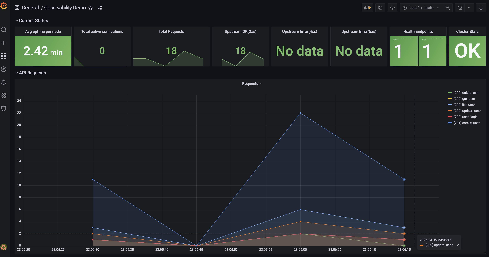
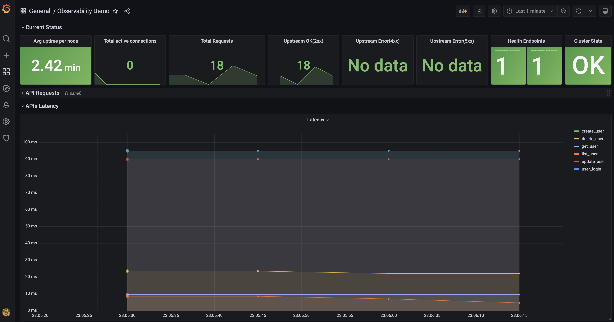

# The app heyui
Demonstration of putting together Golang webservice stack mainly use [gorilla/mux](https://github.com/gorilla/mux), [gorm](https://gorm.io/index.html) and [gorilla/websocket](https://github.com/gorilla/websocket). Check [capabilities section](Capabilities) for more.
- develop branch for environment setup.
- feat/impl-api for full stack demostration.
## Resources
- HTTP on port 8080(default)
- HTTPS on port 8443(default)
- Swagger API document `/swagger`

## Prerequisites
- [make](https://www.gnu.org/software/make/manual/make.html) v3.81+
- [Golang](https://go.dev/dl/) v1.18+
- [Docker](https://www.docker.com/) v20.10.14+
- [Docker compose](https://docs.docker.com/compose/) v2.4.1+
- openssl
- [jq](https://stedolan.github.io/jq/) v1.6+ \[Optional\]for api-tester

## Capabilities
### Basic and bonus
- [x] Runtime configuration(DB, ports, keys...etc).
- [x] Executable standalone native application with PostgresSQL database.
- [x] Executable containerlized app launch with docker compose.
- [x] Series of RESTful interfaces `/swagger` for managing users.
- [x] APIs protected by JWT asymmetric key pair.
- [x] An integration tester `api-tester.sh`.
- [x] Websocket for notification while user login fail.
- [x] An integration tester for Websocket `/login`.
- [x] Switching between HTTP/WS and HTTP/WSS.
- [x] XSS prevented by input sanitization.
- [x] CSRF token enabled.
### Extra bonus
- [x] Prometheus scraping system metrics.
- [x] Observability through Grafana(http://localhost:3000/)/(admin/admin).

Setup http://localhost:9090 Prometheus as datasource and import ObservabilityDemo in Grafana gives you insight of system behavior.



# How-To

## Build and run containerlized app(Recommend)
- Build ```make```
- Run ```docker-compose up```
- Integration test through HTTPS ```bash api-tester.sh```
- Integration test through HTTP ```bash api-tester.sh http```
- 
You are ready to go after the application is listening on reqest. Check log `Listening to port 8080`

## Build and run native app(Alternative)
- Unit Test ```go test ./...```
- Build ```go build -o main```
- Run DB ```make postgres```
- Run application ```./main```

# Coding Style
[for reference...](https://github.com/uber-go/guide/blob/master/style.md)

# TODO
- Unit Test
- Grafana import dashboard and datasource on start up.
- logging framework integration.